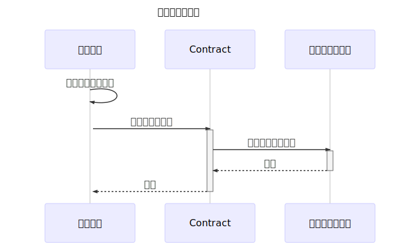
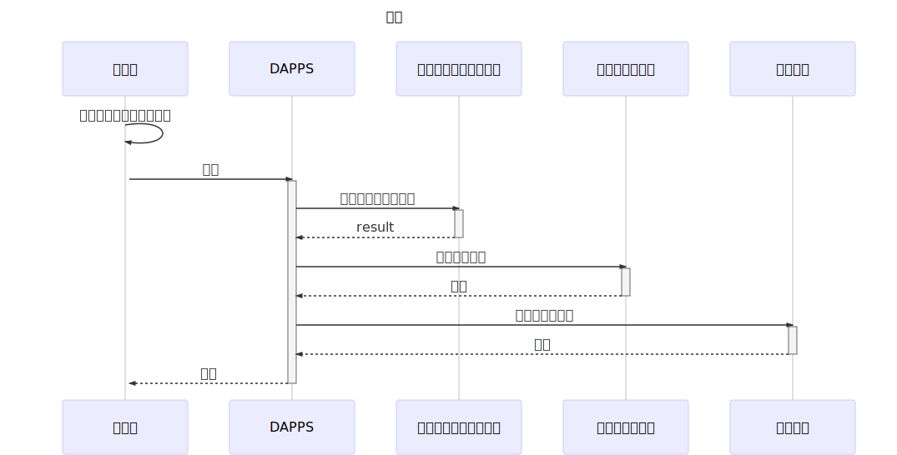
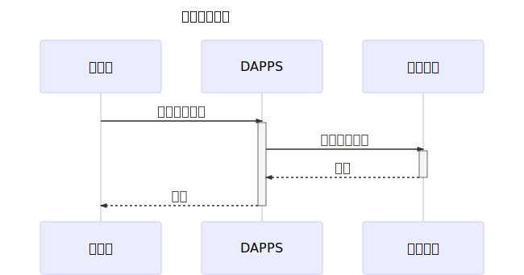

# Mechanism for creating questionnaires in blockchain and accepting votes

*Read this in other languages: [English](README.en.md) , [日本語](README.ja.md) .*

## Overview

Implement a questionnaire system using a smart contract.

## Main point

- The questionnaire consists of questions and options and sets the response period (start and end).
- You can set the start and end date and time for voting. (1 minute minimum voting period)
- Anyone can answer the questionnaire, and can answer only once for each EOA address.
- The situation of the answer is always public.
- Since the content of the questionnaire is hashed and managed, the exact same content can not be created

## What can be achieved by this Dapps

Because information is recorded in the block chain, there is no concern such as falsification of the record

## specification

### Create a questionnaire

*argument*

- The contents of the string `_contents` questionnaire (the format is described below)
- uint `_numberOfChoices` Choices
- uint `_voteStartAt` Start timestamp for accepting answers
- uint `_voteEndAt` Time stamp for closing answer

```json
{
    "question": "What is your favorite drink?",
    "options": ["tea", "coffee", "orange juice", "cola"]
}
```

*Javascript example:*

```js
const data = {
    question: "What's your favorite drink?",
    options: ['tea', 'coffee', 'orange juice', 'cola'],
};

const _contents = JSON.stringify(data);
```

*function*

```solidity
function create(string memory _contents, uint _numberOfChoices, uint _voteStartAt, uint _voteEndAt) public onlyOwner returns (bool) { ... }
```



### Voting

*argument*

- bytes32 `_id` Questionnaire ID
- uint `_choice` Number of choices to vote (number starts with zero)

*function*

```solidity
function vote(bytes32 _id, uint _choice) public acceptingVoting(_id) returns (bool) { ... }
```



### Refer poll results

*argument*

- bytes32 `_id` Questionnaire ID

*function*

```solidity
function getResult(bytes32 _id) public view returns (uint[] memory) { ... }
```



## Implementation

The implementation will be published on GitHub.

https://github.com/PLUSPLUS-JP/crypto-vote
