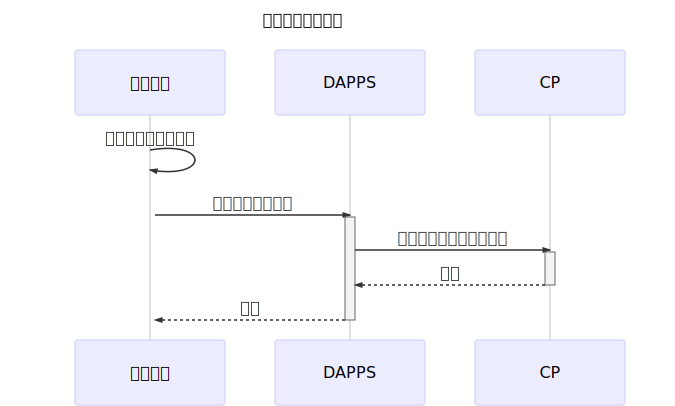
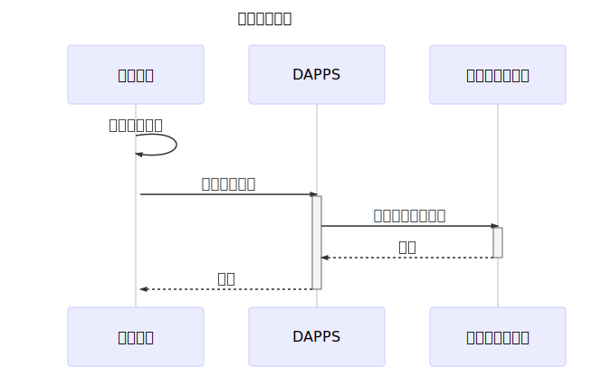

# スマートコントラクトで投票システムを実装

*Read this in other languages: [English](README.em.md), [日本語](README.ja.md).*

## 概要

スマートコントラクトを使った投票システムを実装する

## 要点

- 投票者がETHアドレスを持たなくても投票できるようにする。
- 匿名投票にはなるが、無制限な投票ではなく、あらかじめ投票するためのチケットを配布する。
- 投票チケットには、投票者が特定できる文字列（投票キー）が記載され、投票時に用いる。
- 投票時には投票キーを使用する。投票キーは一度だけ使用できる。
- 投票の状況は常に閲覧可能。
- 投票には開始と終了の日時を設定できる。

## このDappsによって実現できること

ブロックチェーンに情報が記録されるため、記録の改ざんなどの心配がない

## 課題

- 投票者のGASをどうするか？

## 仕様

### キャンペーン作成

引数

string _campaignData
:   投票キャンペーンの情報。JSONで作成する（下記参照）。

uint _optionNumber
:   選択肢の個数

uint _voteStartAt
:   投票の受付の開始タイムスタンプ

uint _voteEndAt
:   投票終了のタイムスタンプ

```json
{
    "question": "あなたの好きな飲みものはなんですか？",
    "options": ["お茶", "コーヒー", "オレンジジュース", "コーラ"]
}
```

*Javascriptでの実装例：*

```js
const data = {
    question: 'あなたの好きな飲みものはなんですか？',
    options: ['お茶', 'コーヒー', 'オレンジジュース', 'コーラ'],
};

const _campaignData = JSON.stringify(data);
```

*関数*

```solidity
function createCampaign(string _campaignData, uint _optionNumber, uint _voteStartAt, uint _voteEndAt) public returns (bool);
```



### 投票者の登録

*引数*

bytes32 _campaignId
:   キャンペーン登録時に発行したID

bytes32[] _voterHashList
:   投稿者を特定するユニークな文字列を `getKeccak256Hash` によりハッシュ化し、それを配列で与える


*Javascriptでの実装例：*

```javascript
const rawVoter = [ /* 投稿者を特定するユニークな文字列 */ ];
const hashedVoter = [];

for (let i = 0; i < rawVoter.length; ++i) {
    // ハッシュ取得
    const keccak256Hash = yield contract.methods.getKeccak256Hash(rawVoter[i]).call({});
    hashedVoter.push(keccak256Hash);
}

const _voterHashList = JSON.stringify(hashedVoter);
```

*関数*

```solidity
addVoter(bytes32 _campaignId, bytes32[] _voterHashList)
        public
        onlyCampaignOwner(_campaignId)
        beforeVoteStart(_campaignId)
        returns (bool);
```



### 投票

*引数*

bytes32 _campaignId
:   キャンペーン登録時に発行したID

bytes32 _voterHash
:   投稿者を特定するユニークな文字列

uint _optionNumber
:   投票する選択肢の番号（番号はゼロ始まり）


*関数*

```solidity
function vote(bytes32 _campaignId, bytes32 _voterHash, uint _optionNumber) public acceptingPolling(_campaignId) returns (bool);
```


### 投票結果参照

*引数*

bytes32 _campaignId
:   キャンペーン登録時に発行したID

*関数*

```solidity
function getResult(bytes32 _campaignId) public view afterVoteEnd(_campaignId) returns (uint[]);
```


## 実装

実装はGitHubにて公開する。

https://github.com/PLUSPLUS-JP/crypto-vote
